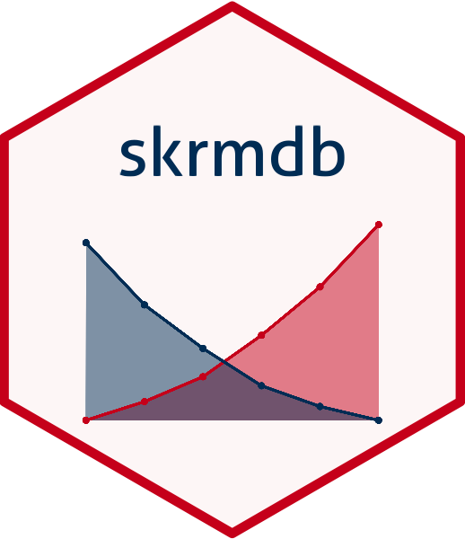

# skrmdb 

Package to estimate ED50 by the methods of Spearman-Karber, Reed-Muench, and Dragstedt-Behrens.

## Installation

```
devtools::install_github("ABS-dev/skrmdb")
```

## Vignettes

This package contains the following manuals and vignettes:

-   skrmdb Package
-   Using skrmdb

## Issues

Report any issues or requests on the package
[issues](https://github.com/ABS-dev/skrmdb/issues) page.
