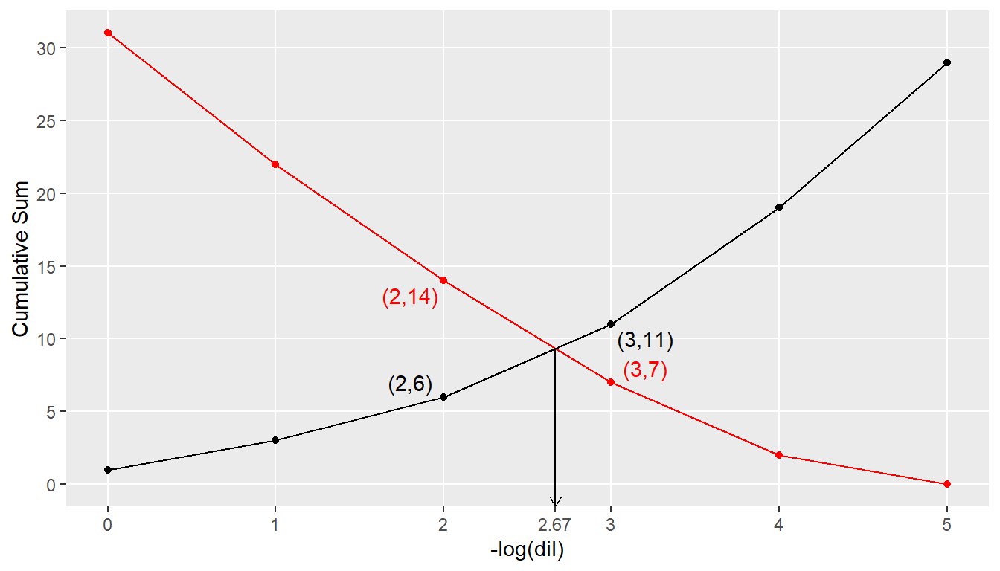
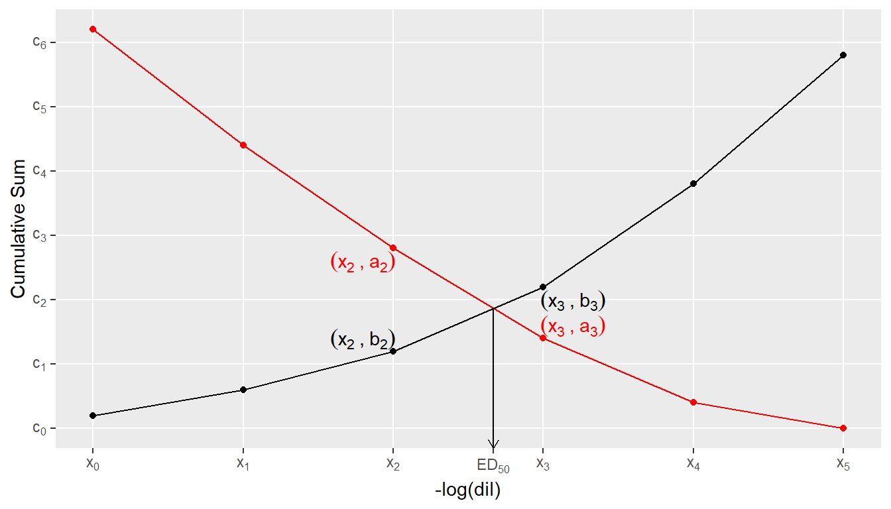
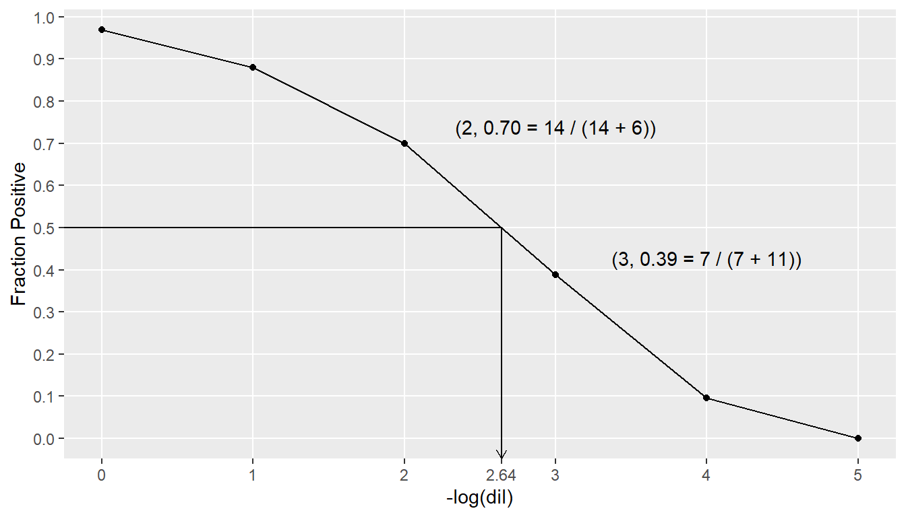
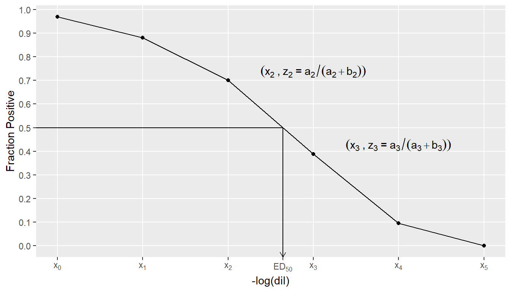
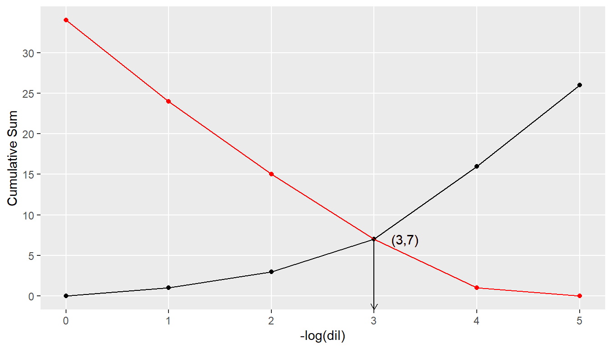
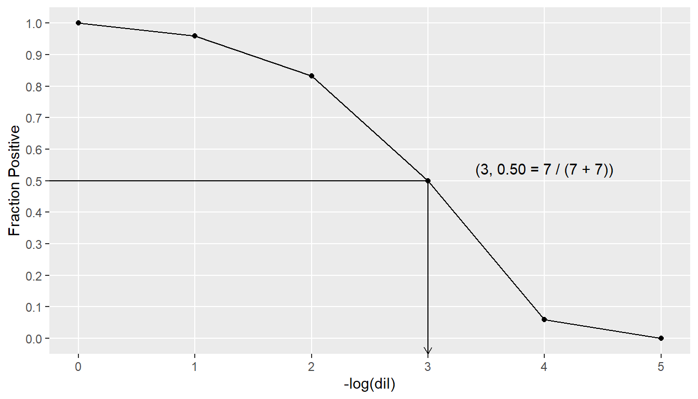

# ED50 Hand Calculations

## Introduction

These notes can be viewed as a supplement to CVB-WI-0281, Nonparametric
Estimation of Median Effective Dose. Their purpose is to give specific
examples of the calculations a technician may perform if computing
\\ED\_{50}\\ by hand for either the Dragstedt-Behrens or Reed-Muench
methods. Using these notes as a guide will also provide the technician
with a tool to check the instructions for computing \\ED\_{50}\\
contained in a firm’s Outline of Production or Special Outline.

In the literature, there are two distinct methods which are both called
“Reed-Muench”. However, one of these methods is actually the
Dragstedt-Behrens method. If one is instructed to use the Reed-Muench
method to compute \\ED\_{50}\\, it is imperative to determine which of
the two methods is actually intended. Since this case of mistaken
identity is so firmly entrenched in the scientific community, we
typically treat this misnomer as a minor issue.

## Data With Equal-Sized Groups

CVB-WI-0281 states that the “Positives are those with increasing
response”. However, in laboratory experiments, it is common for the
number of positives to have a decreasing response. As the
Dragstedt-Behrens and Reed-Muench methods do not actually require this,
our sample data has decreasing positive response. We first consider the
following example data which has 10 subjects at each dose. The columns
“Pos” and “Neg” are the observed responses at each dose. “Cum Pos” is
the cumulative sum of “Pos” and is computed in the same direction as we
observe the number of positive responses increasing. Similarly, “Cum
Neg” is the cumulative sum of “Neg” and is computed in the same
direction as we observe the number of negative responses increasing.
Finally, the column “Fract Pos” is the fraction of the cumulative
responses which are positive at each dose. (e.g. At -log(dil) = 4, the
positive fraction is 2 / (2 + 19) = 0.10.)

[TABLE]

Table 1: Hypothetical data with the same number of subjects at each
dose. Intermediate computations have been added. Variable names that
match those described in CVB-WI-0281 have been added.

### Reed-Muench

Figure 1: Plot of cumulative sums, used by Reed-Muench. The value of
\\ED\_{50}\\ computed by this method is shown. Only the points of
interest are labelled.

\\ED\_{50}\\ is defined to be the dilution at which the two lines
intersect, which is

\\ ED\_{50} = 2 + \frac{(14 - 6)(3 - 2)}{(11-6) - (7 - 14)} = 2.67 \\
The general plot looks like this:

Figure 2: General plot for Reed-Muench.

And the general equation is:

\\ ED\_{50} = x_2 + \frac{(a_2 - b_2)(x_3 - x_2)}{(b_3 - b_2) - (a_3 -
a_2)} \\

### Dragstedt-Behrens

Figure 3: Plot of fraction positive, used by Dragstedt-Behrens. The
value of \\ED\_{50}\\ computed by this method is shown. Only the points
of interest are labelled.

\\ED\_{50}\\ is defined to be the dilution at which the fraction
positive is equal to 0.5, which is

\\ ED\_{50} = 2 + \frac{1}{2} \cdot \frac{(7 + 11)(14 - 6)(3 - 2)}{14
\cdot 11 - 7 \cdot 6} = 2.64 \\

The general plot looks like this:

Figure 4: General plot for Dragstedt-Behrens.

And the general equation is:

\\ ED\_{50} = x_2 + \frac{1}{2} \cdot \frac{(a_3 + b_3)(a_2 - b_2)(x_3 -
x_2)}{a_2 \cdot b_3 - a_3 \cdot b_2} \\

## Data with Different Sized Groups

Occasionally, there is not the same number of subjects at each dose.
However, one of the fundamental assumptions of these methods is that the
number of subjects at each dose is the same. We demonstrate two ways
that the data can be adjusted to account for the unequal group sizes.
The method you choose to use will probably depend on whether you would
rather work with larger integers or with decimals. In either case, the
two methods produce the same Reed-Muench and Dragstedt-Behrens
estimates, apart from rounding.

### Method 1 - Integers

Because each group contains either 9 or 10 subjects, we want to work
with a hypothetical group size that is divisible by both 9 and 10, which
in this case is 90. (If there were either 8 or 10 subjects in each
group, we could choose a hypothetical group size of 40 or 80.)

Continuing with our example, the adjusted number of positives is 90
\\\times\\ Pos / N and the adjusted number of negatives is 90 \\\times\\
Neg / N. “Cum Pos” is now the cumulative sum of the adjusted positives
and “Cum Neg” is the cumulative sum of the adjusted negatives, as
described in [Section 2](#sec-data). Similarly, “Fract Pos” is computed
as before. Using these adjusted values, you can proceed with either
method as described in [Section 2.1](#sec-rm) and
[Section 2.2](#sec-db).

[TABLE]

Table 2: Hypothetical data with different number of subjects at each
dose.

### Method 2 - Decimals

In this case, Adj Pos = Pos / N and Adj Neg = Neg / N. If doing this by
hand, we suggest using at least 4 decimal places to minimize rounding
errors. “Cum Pos” is now the cumulative sum of the adjusted positives
and “Cum Neg” is the cumulative sum of the adjusted negatives, as
described in [Section 2](#sec-data). Similarly, “Fract Pos” is computed
as before. (Notice how the “Fract Pos” column is the same in both
tables.) Using these adjusted values, you can proceed with either method
as described in [Section 2.1](#sec-rm) and [Section 2.2](#sec-db).

[TABLE]

Table 3: Hypothetical data with a different number of subjects at each
dose.

## Boundary Cases

It may happen that there is a dose at which Cum Neg is equal to Cum Pos.
If this happens, then \\ED\_{50}\\ is the -log(dil) value at which the
cumulative responses are equal. For example, in [Table 4](#tbl-data-3),
when -log(dil) = 3, both Cum Neg and Cum Pos are equal and the fraction
positive is 0.5. Thus, \\ED\_{50}\\ is 3 for both the Reed-Muench and
Dragstedt-Behrens methods.

[TABLE]

Table 4: Example data in which “Cum Pos” = “Cum Neg” at -log(dil) = 3.

### Reed-Muench

Figure 5: Plot of cumulative sums, used by Reed-Muench.

### Dragstedt-Behrens

Figure 6: Plot of fraction positive, used by Dragstedt-Behrens.
